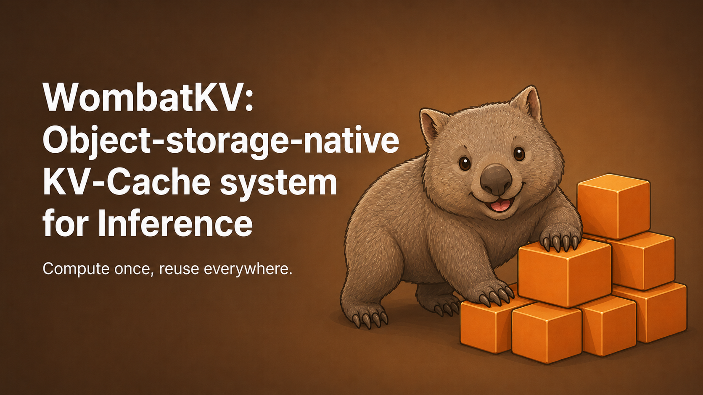

<p align="center">
  
</p>

# WombatKV

[](https://crates.io/crates/wombatkv-node)
[](https://crates.io/crates/wombatkv-cabi)
[](https://crates.io/crates/wombatkv-daemon)
[](https://docs.rs/wombatkv-node)
[](https://github.com/Venkat2811/wombatkv/actions/workflows/ci.yml)
[](https://codecov.io/gh/Venkat2811/wombatkv)
[](LICENSE)

**Object-storage-native KV cache system for LLM inference.**

> *Wombat has your Blocks.*

## Philosophy: object-storage-native

The database world has been solving this shape: hold the durable
truth in object storage, let RAM / NVMe / mmap be the hot path.
Compute is free to die, restart, move, and scale without dragging
the durable state with it. The pattern is not "S3 is RAM"; it is
"durable truth on the bottom, free-to-die compute on top."

- [Turbopuffer](https://turbopuffer.com): vector and full-text search.
- [SlateDB](https://slatedb.io): embedded LSM.
- [WarpStream](https://www.warpstream.com): Kafka.
- [TigerBeetle](https://tigerbeetle.com): OLTP, with diagonal scaling tiering lower LSM levels to object storage.
- [AWS S3 Vectors](https://aws.amazon.com/s3/vectors/) + [Hugging Face Xet](https://huggingface.co/blog/xet-on-the-hub): object storage moving upward into AI-native data types and content-addressed ML artifacts.

Inference memory hasn't had this renaissance. WombatKV is that move
for KV cache.

WombatKV makes KV cache a **shared, addressable resource**. Anything
an engine prefills once (system prompts, RAG context, codebase
context, shared documents, conversation history) lands in an S3
bucket as content-addressed blocks. Any other engine pointing at the
same bucket inherits it: the next process, the next conversation, the
next agent in a fan-out, the next teammate on a different laptop, a
sibling ds4 reading from the same MinIO on the NAS.

The wins compound across dimensions:

- **Cross-restart**: process dies and comes back, no re-prefill.
- **Cross-conversation**: same shared doc, five conversations, conv 1 pays once, convs 2-5 inherit.
- **Cross-agent**: five concurrent reviewers of the same PR, prefill paid once for all.
- **Cross-engine, cross-machine**: two ds4 servers pointed at the same bucket pool prefix-cache between each other.

Content-addressing makes this transparent: the bucket key is a function
of (model + tokenizer + dtype + LoRA + prefix chain), so any engine
computing the same chain finds the same blocks. No engine-id, no
session-id, no coordination.

The 0.1.0-alpha ships with the [ds4](https://github.com/Venkat2811/ds4)
adapter (DeepSeek-V4-Flash), validated on M3 Max with local MinIO and
on Linux with the daemon-mode transport benches.

## Architecture

```
              embedded mode                daemon mode
              (in-process)                 (sidecar)

         +----------------+               +----------------+
         | engine         |               | engine         |
         |  libwombatkv   |               +-------+--------+
         +-------+--------+                       | SHM, TCP, HTTP
                 |                       +--------v-------+
                 |                       | wombatkv-daemon|
                 |                       +--------+-------+
                 |                                |
         +-------v--------+-----------+-----------v-------+
         |              L0 in-process RAM cache           |
         +------------------------------------------------+
         |              L1 local SSD cache                |
         +------------------------------------------------+
         |  L2 object store: S3, MinIO, R2, GCS, Tigris,  |
         |  Azure.  Durable truth, content-addressed,     |
         |  CRC32C end-to-end                             |
         +------------------------------------------------+

         PUT once.  GET & REUSE many.  MIGRATE freely.  OUTLIVE everything.
```

## How fast?

ds4 + WombatKV vs ds4 native, M3 Max with MinIO. **89.7×** TTFT speedup
on cross-restart with kvdisk wiped. **1.39×** on real Gutenberg
multi-round QA. Native ds4 still wins same-process replay and live
session-switch (0.10-0.30×).

<p align="center">
  
</p>

All charts, three campaigns, methodology, honest losses, per-row
breakdowns: **[BENCHMARKS.md](BENCHMARKS.md)** + **[`artifacts/`](artifacts/)**.

## Quickstart

### Try it (5 minutes)

Run [`pi`](https://pi.dev) (an agent harness) with ds4 + WombatKV via
the recipe in [`examples/pi_ds4_wombatkv/`](examples/pi_ds4_wombatkv/):
pre-built `ds4-server` binary, 5 env vars, local MinIO via `docker run`.
Read that example's README for the full step-by-step.

### Build from source

```sh
# 1. Clone the ds4 fork (this branch carries the WombatKV C ABI hooks)
git clone -b release/0.1.0-alpha.pre1.0 https://github.com/Venkat2811/ds4

# 2. Clone wombatkv + build the C ABI cdylib (libwombatkv.{so,dylib})
git clone https://github.com/Venkat2811/wombatkv
cd wombatkv && cargo build --release -p wombatkv-cabi

# 3. Build ds4-server with WombatKV linked in
cd ../ds4 && make ds4-server WOMBATKV=1 WOMBATKV_DIR=../wombatkv

# 4. Start local MinIO (dev defaults: minioadmin/minioadmin on loopback)
docker run -d --name minio-wombatkv -p 9000:9000 -p 9001:9001 \
    -e MINIO_ROOT_USER=minioadmin -e MINIO_ROOT_PASSWORD=minioadmin \
    -v $HOME/.minio-wombatkv:/data \
    quay.io/minio/minio server /data --console-address ":9001"

# 5. Configure + run ds4-server
export DS4_WOMBATKV_ENABLE=1
export WMBT_KV_BUCKET=wombatkv-cache-myteam
export WMBT_KV_S3_ENDPOINT=http://127.0.0.1:9000
export WMBT_KV_S3_ACCESS_KEY=minioadmin
export WMBT_KV_S3_SECRET_KEY=minioadmin
./ds4-server --model your-model.gguf --port 8000
```

WombatKV auto-derives the model fingerprint from the model path.
**You must explicitly set the bucket + S3 credentials.** Dev-default
`minioadmin/minioadmin` is honored only on loopback endpoints; the
daemon rejects them for any non-loopback target so it can't
accidentally write to the wrong account / bucket. Full env reference:
[`book/src/operations/env.md`](book/src/operations/env.md).

### Rust integration (embedding the crates)

Add the C-ABI surface crate (this is what C / C++ engines link
against; Rust callers can use `wombatkv-node` directly):

```toml
[dependencies]
wombatkv-cabi = "0.1.0-alpha.pre1.0"   # alpha pin required; cargo add won't see pre-releases by default
# or for the high-level Rust API without the cdylib:
# wombatkv-node = "0.1.0-alpha.pre1.0"
# wombatkv-daemon = "0.1.0-alpha.pre1.0"
```

## Crates

Most users want one of the top three. The rest are pulled in
transitively or used only when contributing.

| Crate | Audience | What it gives you |
|---|---|---|
| [`wombatkv-node`](https://crates.io/crates/wombatkv-node) | Rust integrators | High-level async API |
| [`wombatkv-cabi`](https://crates.io/crates/wombatkv-cabi) | C / C++ / non-Rust engines | `libwombatkv.{so,dylib}` + `wombatkv.h` |
| [`wombatkv-daemon`](https://crates.io/crates/wombatkv-daemon) | Sidecar deployments | `wombatkv-daemon` binary + transports |
| [`wombatkv-core`](https://crates.io/crates/wombatkv-core) | transitive | Primitive types, errors, reuse helpers |
| [`wombatkv-format`](https://crates.io/crates/wombatkv-format) | transitive | Wire envelope, on-disk segment, CRC32C, BLAKE3 |
| [`wombatkv-radix`](https://crates.io/crates/wombatkv-radix) | transitive | Prefix-radix metadata index |
| [`wombatkv-store`](https://crates.io/crates/wombatkv-store) | transitive | Object-store backend, WAL, CAS |
| [`wombatkv-dst`](https://crates.io/crates/wombatkv-dst) | contributors | Deterministic-simulation test harness |
| [`wombatkv-bench`](https://crates.io/crates/wombatkv-bench) | contributors | Operator and benchmark binaries |

Per-crate READMEs live in [`crates/*/README.md`](crates/).

## What's inside

- **Storage:** any S3-compatible object store. KV blocks are
  content-addressed; no database, no coordinator.
- **Identity:** BLAKE3 over `(model + tokenizer + dtype + TP/PP +
  LoRA + prefix chain)`.
- **Block size:** 128 tokens (token-aligned, multi-token-quantization safe).
- **Local cache:** 3-tier hierarchy. See [`book/src/concepts/architecture.md`](book/src/concepts/architecture.md).
- **Metadata index:** in-memory radix tree; [SlateDB](https://github.com/slatedb/slatedb)-backed implementation for durability.
- **Compression:** zstd by default.
- **Modes:** embedded (linked into the engine via C ABI) or daemon (separate process).
- **Testing:** 336 unit tests + [`wombatkv-dst`](book/src/operations/dst.md) for deterministic-simulation chaos.

## Features

### Core

- [x] Content-addressed KV blocks (BLAKE3 chain hashing).
- [x] Token-aligned 128-token blocks.
- [x] Prefix-share fall-through: prompts sharing their first M blocks store M blocks under identical keys.
- [x] Restore from any prefix via deterministic block-prefix lookup.
- [x] Universal wire envelope (magic, version, length, CRC32C, body) used by every transport and on disk.
- [x] zstd block compression.
- [x] Same-model save and restore.
- [ ] Cross-model restore (research, post-alpha).

### Memory hierarchy & hot tiers

- [x] L0 in-process RAM cache.
- [x] L1 local SSD cache.
- [x] L2 object store.
- [x] Block prefetcher with scored hydration.
- [x] Lookup-path memory guardrail.
- [ ] HBM tier (engine-resident).
- [ ] Typed CPU-RAM tier.
- [ ] CXL-attached memory tier (CXL.mem).
- [ ] L0.5 NVMe scratchpad.
- [ ] Engine-native block-manager bridge.

### Metadata index

- [x] In-memory radix tree.
- [x] SlateDB-backed durable index.
- [x] Bootstrap from object storage.
- [ ] Multi-region replication.

### Storage backends

- [x] AWS S3.
- [x] MinIO.
- [x] Cloudflare R2.
- [x] Google Cloud Storage.
- [ ] AWS S3 Express One Zone.
- [ ] Tigris.
- [ ] Azure Blob Storage.

### Deployment modes

- [x] Embedded mode (C ABI, in-process).
- [x] Daemon / sidecar mode (separate process).
- [x] Multi-tenant prefix isolation.
- [ ] WombatKV Puffer Operator (Kubernetes deployment; cluster-level routing and prewarm).
- [ ] Daemon-to-daemon replication.

### Transport & wire protocols

The wire envelope is transport-agnostic. The list below tracks which
protocols are wired into the daemon's listener and dial side.

- [x] POSIX shared memory.
- [x] TCP.
- [x] HTTP/1.1.
- [ ] WebSocket.
- [ ] HTTP range reads (partial-block fetch from object store).
- [ ] RDMA (RoCE v2 and native verbs).
- [ ] InfiniBand.
- [ ] NVLink (intra-node GPU-to-GPU peer-to-peer).
- [ ] [GPUDirect Storage](https://docs.nvidia.com/gpudirect-storage/) (RDMA-to-GPU memory).
- [ ] [NVIDIA cuObject](https://docs.nvidia.com/gpudirect-storage/cuobject/index.html) (GPUDirect Storage for Objects; KV blocks land directly in GPU memory).
- [ ] NIXL-style transfer.
- [ ] Mooncake-style transfer.

### Engine integrations

- [x] [`antirez/ds4`](https://github.com/antirez/ds4) (reference integration).
- [ ] [`vllm-project/vllm`](https://github.com/vllm-project/vllm)
- [ ] [`sgl-project/sglang`](https://github.com/sgl-project/sglang)
- [ ] [`ggerganov/llama.cpp`](https://github.com/ggerganov/llama.cpp)
- [ ] [`ollama/ollama`](https://github.com/ollama/ollama)
- [ ] [`ai-dynamo/dynamo`](https://github.com/ai-dynamo/dynamo) (NVIDIA Dynamo)
- [ ] [`llm-d/llm-d`](https://github.com/llm-d/llm-d) (Kubernetes-native LLM serving)

### Bindings

- [x] C / C++.
- [x] Rust.
- [ ] Python.
- [ ] Go.
- [ ] Zig.

### CLI

- [ ] `wombatkv` CLI binary (bucket inspect, block dump, metadata audit, DST seed-replay, cache warmup).

### Testing & quality

- [x] 336 unit tests across the workspace.
- [x] `wombatkv-dst`: BUGGIFY-style chaos, seeded fault injection, in-memory oracle.
- [x] 20 fault classes covering S3, daemon transport, wire format, SlateDB, multi-tenant, resource exhaustion, platform divergence.
- [x] 200 deterministic plans per sweep (20 classes × 10 seeds).
- [x] Adversarial-roundtrip integration test on the C ABI boundary.
- [x] Linux + macOS CI matrix.
- [x] Drift detectors for platform-specific code and clippy warnings.
- [ ] `cargo miri` lane.
- [ ] AddressSanitizer / ThreadSanitizer lanes.
- [ ] End-to-end ds4 cross-restart bench on Linux.

### Operations

- [x] `make ci` canonical gate.
- [x] 10 operator and bench binaries.
- [ ] Prometheus exporter.
- [ ] OpenTelemetry / OTLP exporter.
- [ ] Grafana dashboards.
- [ ] Helm chart for the daemon Kubernetes deployment.

### Platform support

- [x] macOS (M3 Max validated end-to-end).
- [x] Linux (transport benches validated on x86_64; end-to-end ds4 path pending).
- [ ] Windows (no plans).

## Docs

In-repo:

- [`book/src/concepts/architecture.md`](book/src/concepts/architecture.md): crate map, embedded & daemon
  modes, block-prefix compute, 3-tier cache hierarchy.
- [`book/src/concepts/consistency.md`](book/src/concepts/consistency.md): consistency model
  (read-your-writes, durability, isolation; what holds, what does NOT).
- [`book/src/concepts/recovery.md`](book/src/concepts/recovery.md): recovery protocol per
  failure class (what WombatKV does automatically vs operator action).
- [`book/src/operations/dst.md`](book/src/operations/dst.md): Deterministic Simulation Testing
  primitives, failure classes, sweep harness, how to wire chaos
  sites.
- [`book/src/operations/bench-methodology.md`](book/src/operations/bench-methodology.md):
  canonical warmup-primed 5-trial bench protocol; per-trial
  reproduction.
- [`book/src/getting-started/dev-quickstart.md`](book/src/getting-started/dev-quickstart.md):
  local-dev bring-up.

## Status

**0.1.0-alpha**: ds4 adapter only, no production deployment recommended.

- **C ABI:** stable at version 1.0 (`crates/wombatkv-cabi/include/wombatkv.h`).
- **Wire format:** v1, single-format. No back-compat reader; future changes will use staged migrations.
- **Pending:** end-to-end ds4 path on Linux, cloud S3 production validation, multi-client daemon load.

## See also

- [`book/src/operations/env.md`](book/src/operations/env.md): every `WMBT_KV_*` env var.
- [`book/src/operations/bench.md`](book/src/operations/bench.md): the 10 bench binaries.
- [`book/src/concepts/architecture.md`](book/src/concepts/architecture.md): crate layout and block-prefix restore.
- [`CHANGELOG.md`](CHANGELOG.md): release history.
- Per-crate READMEs in `crates/*/README.md`.

## Development

```sh
make ci                  # fmt + clippy + lib tests + DST sweep + drift detectors
./scripts/dst-sweep.sh   # 20 fault classes x 10 seeds
```

See [`CONTRIBUTING.md`](CONTRIBUTING.md) for the contributor lifecycle.

## Acknowledgements

WombatKV stands on the shoulders of these projects and the people behind them:

- [`antirez/ds4`](https://github.com/antirez/ds4): the C engine this alpha integrates with.
- [`slatedb/slatedb`](https://github.com/slatedb/slatedb): backs the L1 metadata index.
- [`foyer-rs/foyer`](https://github.com/foyer-rs/foyer): underpins the in-process L0/L1 cache hierarchy.
- [LMAX Disruptor](https://lmax-exchange.github.io/disruptor/) + [Trisha Gee](https://trishagee.com/presentations/disruptor_101/): the SHM ring under `wombatkv-daemon` descends from this via [`Venkat2811/myelon`](https://github.com/Venkat2811/myelon).
- [TigerBeetle VOPR](https://docs.tigerbeetle.com/about/vopr/) + [FoundationDB BUGGIFY](https://apple.github.io/foundationdb/testing.html): the DST pedigree.
- [vLLM](https://github.com/vllm-project/vllm): raised KV cache to a first-class inference subsystem.
- [SGLang HiCache](https://github.com/sgl-project/sglang): KV offload + reuse in the same lineage.
- [LMCache](https://github.com/LMCache/LMCache) and [Mooncake](https://github.com/kvcache-ai/Mooncake): sibling KV substrates.
- [`ovg-project/kvcached`](https://github.com/ovg-project/kvcached): engine-integration template.
- [`pi.dev`](https://pi.dev) by mitsuhiko: agent harness used in `examples/pi_ds4_wombatkv/`.

Built with [](https://openai.com/codex) [](https://www.anthropic.com/claude-code) (`git log --grep "Co-Authored-By: Claude"` and `--grep "Co-Authored-By: Codex"` for the breakdown).

## Citation

If WombatKV helps your work, please cite:

```bibtex
@software{wombatkv2026,
  author       = {Venkat Raman and {WombatKV Contributors}},
  title        = {{WombatKV: object-storage-native KV cache system for LLM inference}},
  year         = {2026},
  version      = {0.1.0-alpha.pre1.0},
  url          = {https://github.com/Venkat2811/wombatkv},
}
```

See [`CITATION.cff`](CITATION.cff) for the machine-readable form.

Issues, feedback, discussions, and PRs are welcome & appreciated! Reach
out on GitHub or Twitter [@venkat_systems](https://x.com/venkat_systems).

## License

Apache-2.0. See [`LICENSE`](LICENSE).
