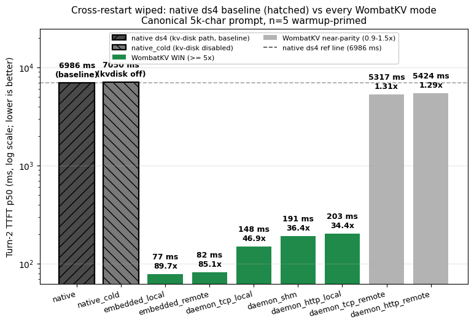
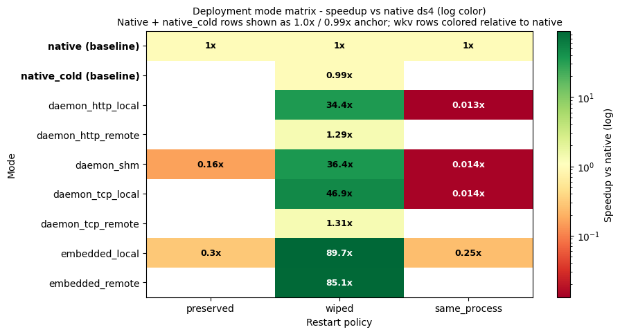
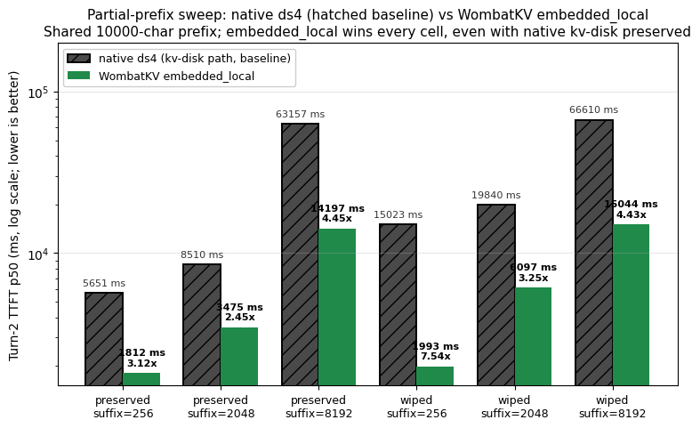
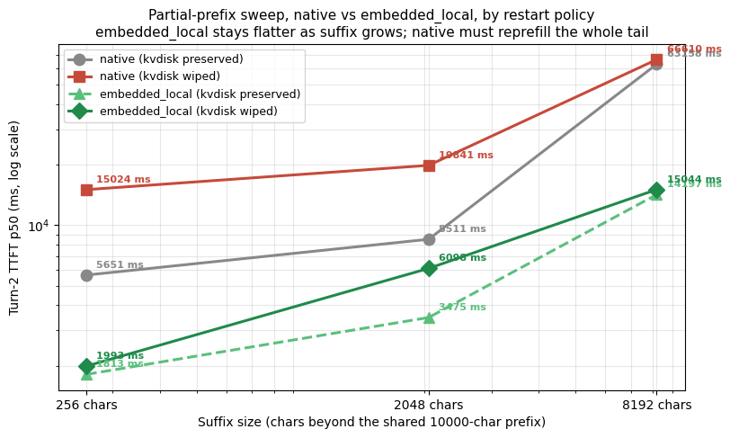
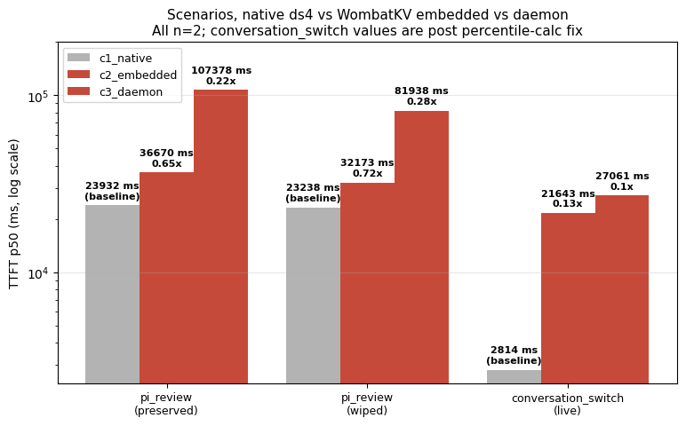

# Deployment mode matrix: 2026-05-24

Methodical apples-to-apples sweep: same prompt, same machine, sweep
across 6 deployment modes × 3 restart policies. Single-day,
single-harness, single-engine campaign.

## Methodology

| Field | Value |
|---|---|
| Date | 2026-05-24 |
| Hardware (engine) | Mac M3 Max, 96 GB RAM, macOS Darwin 25.1.0 |
| Storage (local MinIO) | Docker MinIO at `127.0.0.1:9100` |
| Storage (remote MinIO) | Docker MinIO on a peer machine over WiFi LAN |
| Model | `DeepSeek-V4-Flash-IQ2XXS-w2Q2K-AProjQ8-SExpQ8-OutQ8-chat-v2-imatrix.gguf` (ds4 default) |
| Context window | 32768 tokens |
| Canonical prompt | first 5000 chars of Project Gutenberg #1184 (~1500 tokens) |
| ShareGPT prompts | first 8 rows of `sharegpt_min1k_50.jsonl` (each used once, n=8 distribution) |
| Decode budget | `max_tokens=256` for exact family |
| Trials per cell | n=5 (canonical restart_*), n=3 (canonical same_process), n=8 (ShareGPT), n=2 (partial-prefix + scenarios) |
| Warmup protocol | After each restart, a small `max_tokens=1` warmup request primes Metal kernel JIT before turn-2 measurement. Same-process cells skip warmup. |

## Charts

### Cross-restart wiped, speedup by mode

The headline campaign: same prompt, kvdisk wiped, sweep across all
6 WombatKV modes. embedded_local at **89.7×** and embedded_remote
at **85.1×** dominate. daemon modes are still strong (34-47×) but
clearly behind. daemon_*_remote at 1.3× shows the daemon-side
orchestration weakness, the wire isn't the problem (see
remote_daemon_diagnostics in `../2026-05-24_public-corpus-replay/`).

### Speedup heatmap, mode × restart policy

Log-color heatmap. Green cells = WIN, red = LOSS. The pattern is
clean: wiped column is uniformly green (every WombatKV mode beats
native cold-prefill), preserved column is mixed (kvdisk wins for
exact same prompt), same_process column is uniformly red
(WombatKV adds overhead with nothing to restore).

### Partial-prefix sweep, embedded_local vs native

embedded_local beats native across all 6 cells of the sweep, even
when kvdisk is preserved. The strongest cell is **wiped + suffix=256
at 7.54×**. The preserved-kvdisk wins (2.45-4.45×) are the most
important non-restart claim: WombatKV beats ds4 even when the local
cache is intact, as long as the prompt has partial-prefix overlap.

### Partial-prefix: LINE graph

Same data, line-graph view. Log-log scale, suffix size on x-axis,
TTFT on y-axis. Red = native kvdisk wiped (climbs steeply), gray =
native kvdisk preserved, dashed light-green = embedded preserved,
solid dark-green = embedded wiped. Both WombatKV lines stay flatter
as suffix grows, the divergence at suffix=8192 is dramatic
(native 56-69 s vs embedded 14-15 s).

### Scenario losses, pi_review + conversation_switch

Honest losses, log-x scale. WombatKV loses on **conversation_switch**
(0.10-0.13×, daemon catastrophic at 27 s vs native 2.8 s) and
**pi_review** (0.22-0.72×). Both are interleaved single-server
workloads where ds4's own state machine is doing what it should
and WombatKV's save+load adds pure overhead.

## Files

| File | Rows | Description |
|---|---:|---|
| [`exact_prompt_matrix.csv`](./exact_prompt_matrix.csv) | 21 | 6 modes × 3 restart policies on canonical_long_prompt, plus ShareGPT exact-replay. Includes 2 `native_cold` baseline rows (kvdisk fully disabled). |
| [`partial_prefix_sweep.csv`](./partial_prefix_sweep.csv) | 30 | 3 suffix sizes × 2 restart policies × 5 modes (native, native_cold, embedded_local, daemon_shm, daemon_tcp_local, daemon_http_local). Shared 10000-char prefix. |
| [`scenarios.csv`](./scenarios.csv) | 9 | pi_review (5 agents × 5 turns × 2 restart policies) + conversation_switch (5 users × 5 turns round-robin, post percentile-calc fix). |
| [`claim_matrix.md`](./claim_matrix.md) | - | The campaign's final supported / qualified / unsupported claim taxonomy. |
| [`methodology_caveats.md`](./methodology_caveats.md) | - | 10 caveats that materially affect interpretation of every table here. |
| [`gaps_and_next_steps.md`](./gaps_and_next_steps.md) | - | Forward-looking analysis: missing cells, remote-daemon root-cause hypotheses, suite hardening playbook. |

## Caveats

- Native baseline uses `--kv-disk-dir` + `--kv-cache-min-tokens 256`. This is the honest comparison against ds4's real production checkpoint path.
- `same_process` cell is two requests with the same prompt in one server process; not an uninterrupted live continuation.
- pi_review + conversation_switch are n=2 trials each; treat as directional.
- Partial-prefix sweep daemon rows are n=1; embedded rows are n=2.
- `conversation_switch` was rerun after fixing the `lib.percentile(xs, 0.95)` → `lib.percentile(xs, 95)` bug; results above are from the fixed rerun.
- Remote daemon `get_ms` takes 2936-3573 ms vs embedded_remote's 10 ms, root cause is daemon-side orchestration, not the network. See sibling campaign for the stage-breakdown evidence.
