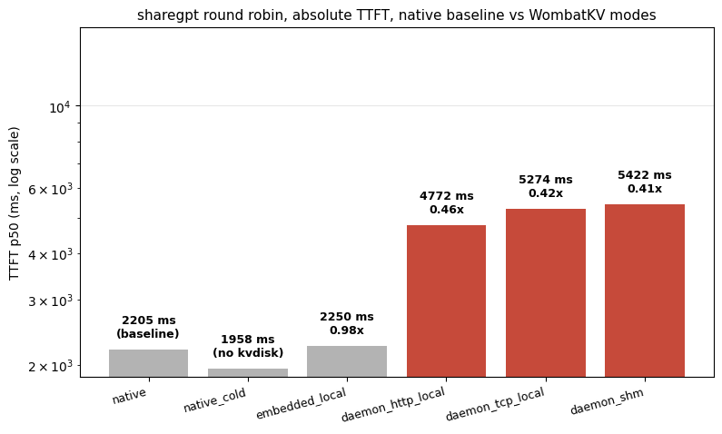
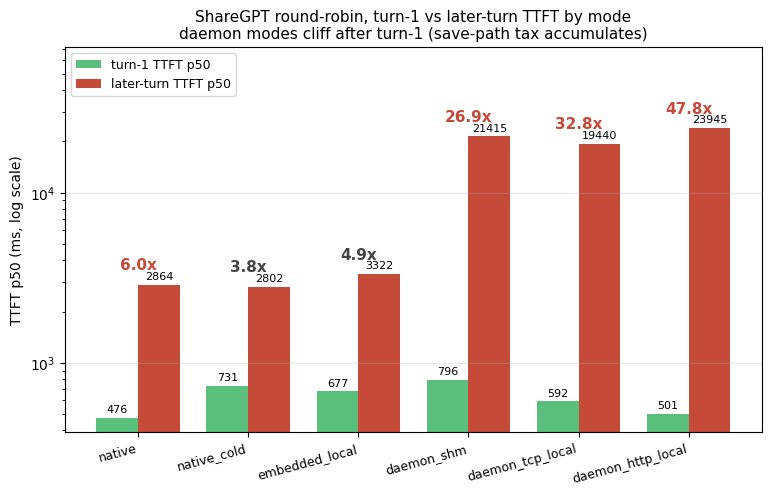
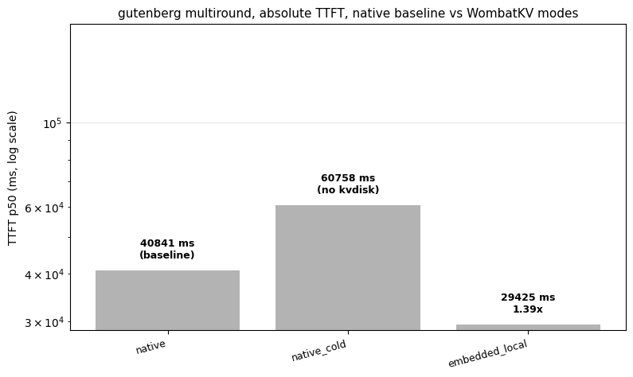
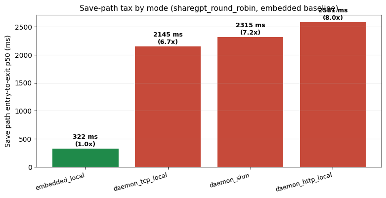
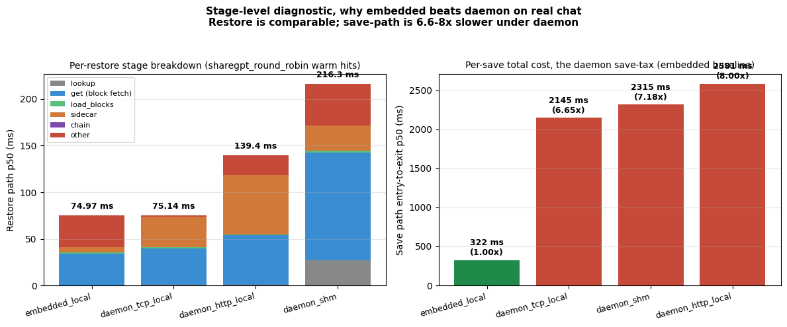

# Public corpus replay: 2026-05-24

Real-world multi-turn workloads (ShareGPT round-robin + Gutenberg
multi-round QA) plus per-restore + per-save stage timings and a raw
TCP transport microbench. Same-day extension of the deployment-mode
matrix campaign.

## Methodology

| Field | Value |
|---|---|
| Date | 2026-05-24 (evening extension) |
| Hardware (engine) | Mac M3 Max (same as deployment-mode-matrix) |
| Storage | Local Docker MinIO `127.0.0.1:9100` (the Linux test host LAN MinIO for transport bench only) |
| ShareGPT corpus | first 8 conversations from `sharegpt_conv_16_mt4_8.json` (max 3 user turns each, round-robin) |
| Gutenberg corpus | 6 conversations, each ~12k-char first turn (Project Gutenberg #1184 excerpt), 3 turns per conversation |
| Decode | `max_tokens=32`, `thinking: disabled` (added mid-session to force visible assistant content vs reasoning-only) |
| Trials | n=2 ShareGPT native + native_cold + embedded_local; n=1 ShareGPT daemon modes + Gutenberg; n=8 transport bench |
| Transport bench | `wombatkv-tcp-multi-load-bench`, 8 clients × 200 ops × 4096-byte payload |

## Charts

### ShareGPT round-robin: TTFT speedup

The honest counter-finding. On real public multi-turn chat,
embedded_local is **at parity with native** (0.98×) and all three
daemon modes are **0.41-0.46× LOSS**. WombatKV doesn't win this
regime, ds4's own per-session checkpoint path handles interleaved
chat reuse fine without WombatKV's save+load overhead.

### ShareGPT round-robin, turn-1 vs later-turn cliff

Log-y grouped bars showing turn-1 (light green) vs later-turn (red)
TTFT for each mode. The ratio annotations show the cliff: native
and embedded climb 3-5× from turn-1 to later-turn (expected: KV
grows as conversations extend), but **daemon modes climb 26-48×**
because each save-path round-trip stacks on top. The save-path
overhead accumulates across the round-robin's many turns.

### Gutenberg multi-round QA: TTFT speedup

The opposite story: on a real long-document multi-turn QA workload,
embedded_local **beats native by 1.39× on TTFT median** and 2.04×
on turn-1. Total latency is 1.68× faster. native_cold (kvdisk
disabled) is 0.67×: 1.49× SLOWER than warm native, which
shows the kvdisk path does real work even on this Gutenberg shape.
The daemon Gutenberg rows were intentionally cut after the
ShareGPT daemon LOSS pattern made it clear they'd be worse.

### Save-path tax by mode

The diagnostic root-cause for daemon LOSSES on real chat. Save-path
medians from ShareGPT round-robin: **embedded saves take 322 ms;
all 3 daemon modes take 2.1-2.6 seconds: 6.6-8× slower**. On
workloads that save state every turn (real chat), this tax
accumulates and dominates.

### Per-restore + per-save stage breakdown

Two-panel diagnostic. **Left:** per-restore stages stacked (lookup,
get, load_blocks, sidecar, chain, other). Restore is *comparable*
across modes, embedded and daemon-tcp-local both ~75 ms total;
daemon_shm 216 ms is the outlier due to its 27 ms lookup +
115 ms get. **Right:** per-save total cost. The save-path is
where the daemon tax lives. Net story: restore is similar, save
is where daemon loses.

## Files

| File | Rows | Description |
|---|---:|---|
| [`public_workloads.csv`](./public_workloads.csv) | 9 | sharegpt_round_robin × 6 modes + gutenberg_multiround × 3 modes (native, native_cold, embedded_local, daemon legs cut intentionally). |
| [`per_restore_stage_timings.csv`](./per_restore_stage_timings.csv) | 8 | Per-restore lookup / get_ms / load_blocks / sidecar / chain / entry_to_exit medians. Includes 3 remote rows. |
| [`per_save_stage_timings.csv`](./per_save_stage_timings.csv) | 4 | Per-save stage entry_to_exit medians. Surfaces the 6.6-8× daemon save tax. |
| [`transport_bench.csv`](./transport_bench.csv) | 2 | Raw TCP put/get throughput + latency, loopback vs LAN. |
| [`remote_daemon_diagnostics.md`](./remote_daemon_diagnostics.md) | - | Why remote daemon modes are slow despite same MinIO; daemon-side `get_ms` dominates. |

## Key findings

**The most important new finding**: on real multi-turn long-document
QA (Gutenberg), embedded_local **beats native ds4 by 1.39× TTFT and
1.68× total**. The 2.04× turn-1 speedup is the cleanest visualization
of WombatKV amortizing the long shared document across the
conversation's turns. First real-workload WIN that isn't
exact-restart-recovery.

**The honest counter-finding**: on ShareGPT round-robin (interleaved
8 conversations), embedded_local is at parity with native and all
3 daemon modes are 2.4-2.5× SLOWER on TTFT. The daemon weakness
diagnosed: per-save stage timings reveal daemon save path takes
2.1-2.6 seconds vs embedded's 0.32 seconds, a **6.6-8× save-side
overhead** that dominates whenever the workload saves new state
every turn.

**Remote daemon weakness diagnosed**: embedded_remote spends 10 ms in
block fetch; daemon-tcp/http-remote spend 2936 / 3573 ms, same
remote MinIO, same network. The bottleneck is daemon-side
orchestration, not the wire. Raw TCP at the same payload size hits
2361 ops/s loopback and 493 ops/s LAN; the gap to close is in the
daemon retrieve/serve path.

## Caveats

- **n=1 trials** on Gutenberg + daemon ShareGPT cells. ShareGPT native + native_cold + embedded_local are n=2 in the final rerun.
- **Gutenberg daemon modes were intentionally cut** after the ShareGPT daemon LOSS pattern was clear; only native + native_cold + embedded_local ran for Gutenberg.
- **`cached_tokens_p50: 0`** on every row: JSON-level cache attribution is broken (a known caveat); server-log `[MyelonInstr] result=hit` is the ground truth.
- **`thinking: disabled`** is a control flag added mid-session; rows captured before that flag landed were deleted to keep the table internally consistent.
