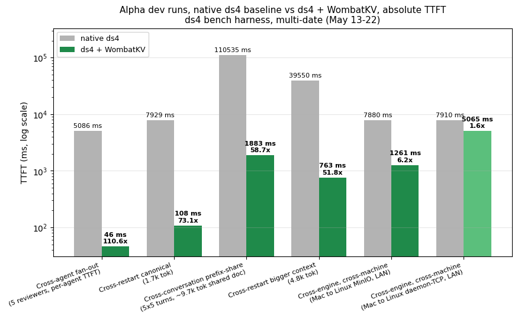
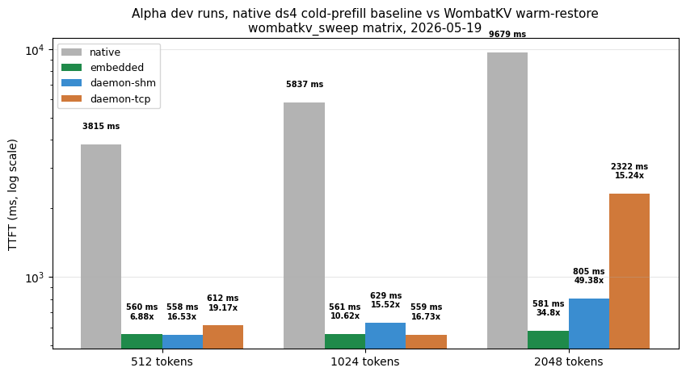
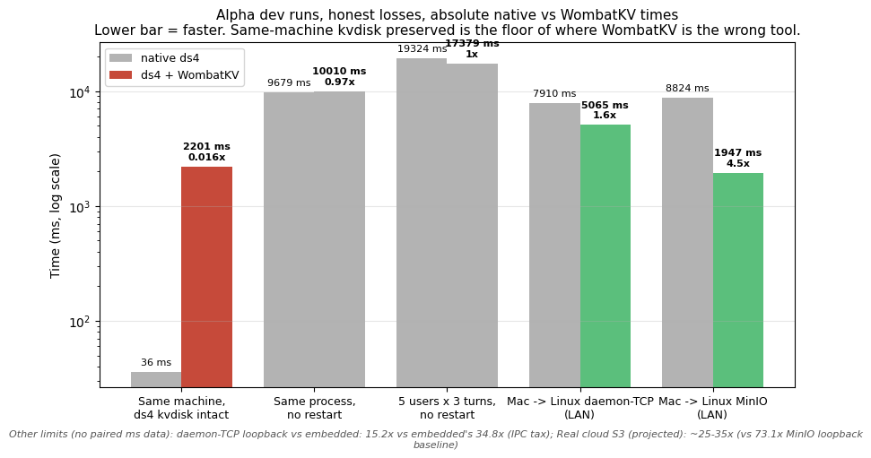
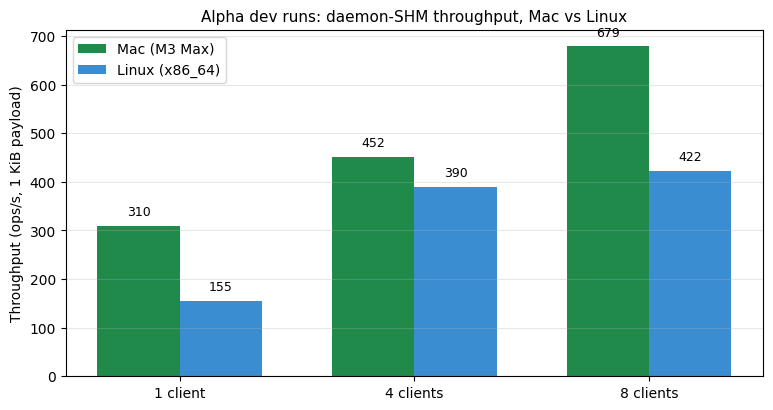

# Alpha dev runs: May 13-22, 2026

Curated copies of benchmark data collected during the WombatKV alpha
development period. Multi-date, multi-harness, ds4's own bench-scripts directory. These rows reflect
the engineering iteration that produced the 0.1.0-alpha integration.

## Provenance

- Source corpus: development bench output across the ds4 fork's development branch + WombatKV late-alpha runs.
- Date range: 2026-05-13 through 2026-05-22.
- Harness: `ds4/scripts/multi_trial_bench.py`, `ds4/scripts/multi_conv_bench.py`, `ds4/scripts/mode_smoke.py` (and a few one-off shell drivers).
- Hardware: M3 Max for most rows; a Linux x86_64 test host for the cross-host paths.

These rows are NOT the canonical headline campaign for the launch.
For that see [`../2026-05-24_deployment-mode-matrix/`](../2026-05-24_deployment-mode-matrix/).
The alpha-dev rows are kept because they're the historical evidence
that the system worked end-to-end during development.

## Charts

### Headline speedups during alpha dev

Six wins across the development period, log-y axis to capture the
dynamic range from 110× (pi-review cross-agent fan-out, 5 reviewers
inheriting prepopulated bucket state) down to 1.6× (Mac → Linux
daemon-TCP over WiFi LAN, bandwidth-bound). The 73.1× canonical
cellB and 58.7× cross-conversation are the two numbers most
frequently cited from this period.

### Speedup by mode × context size

The `wombatkv_sweep` matrix run on 2026-05-19 with three context
sizes (512, 1024, 2048 tokens). The native bar stays at ~1× (it's
the baseline). All three WombatKV modes scale with context size.
daemon-SHM hits 49.4× at 2048 tokens because larger contexts
amortize the IPC overhead better.

### Honest losses & limits

Horizontal bars, log-x, parity at 1.0×. Red = LOSS, gray = NEUTRAL,
light green = SMALL_WIN. The biggest red bar is the
**kvdisk-preserved scenario at 0.016×**, when ds4's local cache
is still warm, the local round-trip (36 ms) beats WombatKV's S3
round-trip (2201 ms) by ~60×. WombatKV's job is when that local
cache is gone.

### Daemon SHM throughput: Mac vs Linux

single + multi-client load bench on 2026-05-18. Mac
saturates at ~679 ops/s with 8 clients; Linux saturates lower at
~422 ops/s. Sub-linear scaling on both, the foyer + S3
boundary is the bottleneck, not the SHM ring itself.

## Files

| File | Description |
|---|---|
| `headlines.jsonl` | 8 canonical headlines from this period (73.1× cell-B, 58.7× multi-conv, 104.8× post-prewarm, etc.) |
| `cellb_5trial_warmup_2026-05-17.jsonl` | Per-trial breakdown of the 73.1× canonical cell-B run |
| `multi_conv_5x5.csv` | Per-turn breakdown of the 58.7× cross-conversation run |
| `cross_host.jsonl` | Mac engine + Linux MinIO / daemon over LAN (Path A, Path B) |
| `mode_matrix.csv` | `wombatkv_sweep` 4 modes × 3 context sizes (2026-05-19) |
| `transport_load_bench.csv` | SHM single + multi-client throughput, Mac and Linux |
| `losses.jsonl` | Honest non-wins from this period |

## Notable rows

| Scenario | Date | Speedup |
|---|---|---:|
| Cell-B 5-trial warmup-primed 1.7k tok canonical | 2026-05-17 | 73.1× |
| Multi-conversation 5×5 ~9.7k tok shared doc | 2026-05-17 | 58.7× |
| Cell-B 1.3k tok post-prewarm tuned | 2026-05-18 | 104.8× |
| Cell-B 4.8k tok bigger context post-CRC | 2026-05-22 | 51.8× |
| pi-review xrestart 5 agents (per-agent TTFT, prepopulated bucket) | 2026-05-16 | 110× |
| Cross-restart kvdisk preserved (honest LOSS) | 2026-05-16 | 0.016× |
| Mac → Linux daemon-TCP over LAN | 2026-05-18 | 1.6× |

See [`../../BENCHMARKS.md`](../../BENCHMARKS.md) for the cross-campaign
comparison including how these rows reproduce (or don't) in the
2026-05-24 methodical campaign.
